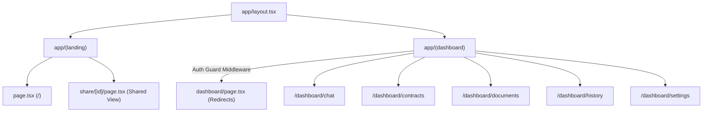
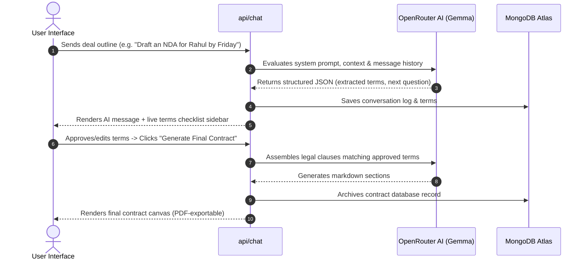

<div align="center">

<p align="center">
  
</p>

### Legal Contracts at the Speed of Chat

DealDost AI is a premium, cinematic legal-tech SaaS platform designed to transform informal Hinglish and English business deals into structured, legally-binding contract assets. Built for modern freelancers, creators, and professionals in India, it simplifies legal drafting and negotiations through an intuitive, AI-backed interface.
<p>
  <a href="https://deal-dost-ai.vercel.app/">🌐 Live Demo</a> •
  <a href="./CONTRIBUTING.md">🤝 Contributing</a> •
  <a href="https://github.com/omprakash-sahu-code/DealDost-AI/issues">🐛 Report Bug</a>
</p>

<br>


</div>

---

## 📅 Version & Release History

### **v2.0.0** — *July 4, 2026* (Latest)
- **Core Database Persistence**: Fully integrated MongoDB Atlas for user sessions, conversation persistence, contracts archiving, and security logging.
- **OpenRouter AI Integration**: Implemented Gemma 26B AI engine to parse multi-message chats, extract structured deal metadata, and generate legal clauses.
- **Interactive Terms Checklist**: Overhauled the preview workflow into a checkable terms card dashboard allowing active inline editing and approval before final document generation.
- **Visual PDF Export**: Styled on-screen signatures and generated standard legal headers, watermarks, and dynamically spaced signature lines for PDFs.
- **Production Optimizations**: Integrated local Next.js rate limiters, global React error boundary UI, lazy-loaded workspaces, and HTTP security headers.

---

## 💼 Tech Stack

<p align="center">


</p>

---


## 🛠️ System Architecture

DealDost AI separates the public cinematic marketing landing page from the secure, authenticated dashboard workspace via Next.js App Router route groups.

### Layout Routing Hierarchy


### Deal-to-Contract Data Flow
This chart illustrates the request lifecycle when a user initiates a conversation to draft a freelance or NDA contract:


---

## 📂 Project Directory Structure

```text
DealDost_AI/
├── app/
│   ├── (landing)/              # Cinematic landing pages & shared viewer
│   ├── (dashboard)/            # Authenticated workspace panel views
│   ├── api/                    # Serverless API routes (auth, chat, contracts, logs)
│   ├── error.tsx               # App-level runtime React error boundary
│   └── layout.tsx              # Root HTML wrapper and global SEO configurations
├── components/
│   ├── landing/                # Scroll-triggered canvas animations & navbar
│   ├── dashboard/              # Workspace logic (Chat, Documents, Settings)
│   ├── auth/                   # Password login and registration modal overlays
│   └── shared/                 # DealDost Logo & LoadingSpinner fallback animations
├── lib/                        # Shared utilities (JWT, db singleton, rate limiter)
├── models/                     # Mongoose database models (User, Contract, Conversation)
├── hooks/                      # Custom hooks interfacing API transactions
├── context/                    # AuthContext managing token validation state
├── types/                      # TypeScript definitions mapping API models
├── utils/                      # Client-side helpers (jsPDF formatting, clipboard)
└── contribution.md             # Code contribution & local development guide
```

---

## 🔒 Security & Optimization Patterns

- **JWT Auth & Guard Rails**: Authentication is handled via edge-compatible tokens stored in HTTP-only `dealdost_token` cookies, protected by Next.js `middleware.ts` guards.
- **In-Memory Rate Limiting**: Throttles critical API access (`/api/chat` at 15 req/min, `/api/auth/login` at 5 req/min) to prevent brute-forcing and token exhaustion.
- **Workspace Bundle Splitting**: Workspaces are dynamically loaded using `next/dynamic` to ensure rapid initial page load speeds for users entering the dashboard.
- **Advanced Headers Config**: Leverages HTTP security headers like `X-Frame-Options: DENY` and `X-Content-Type-Options: nosniff` directly via the configuration layer.

---

## 🤝 Contributing & Local Development

For detail on installing dependencies, setting up local environment variables (`.env.local`), running checks, or opening Pull Requests, please checkout [CONTRIBUTING.md](./CONTRIBUTING.md).

---

## ⭐ Support

If you like **DealDost AI** or found it useful, consider supporting the project!

<p>
  <a href="https://github.com/Omprakash2067/DealDost_AI">
    
  </a>

  <a href="https://github.com/Omprakash2067/DealDost_AI/fork">
    
  </a>
</p>

---

<p align="center">
  ⚖️ <b>DealDost AI</b> is an open-source legal-tech platform built for learning, innovation, and real-world impact.
</p>

<p align="center">
  Made with ❤️ by <b>DealDost-AI Team</b>. 
</p>
